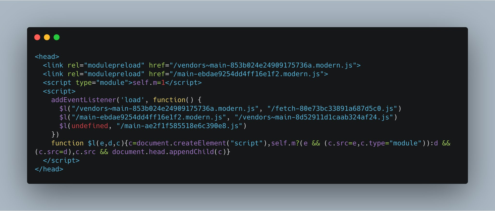
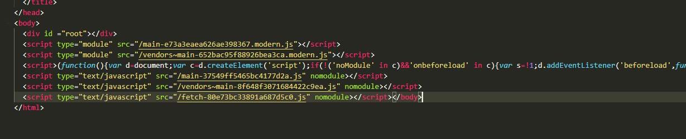

# Webpack module-nomodule plugin

## Installation

`npm install --save-dev webpack-module-nomodule-plugin`

or

`yarn add -D webpack-module-nomodule-plugin`

## Why

This automates the generation of module-nomodule scripts.

This project relies on [html-webpack-plugin](https://github.com/jantimon/html-webpack-plugin).

[module-nomodule](https://philipwalton.com/articles/deploying-es2015-code-in-production-today/) explained.

## How to use

1. Create separate build steps for your modern and legacy builds in your webpack config.  
1. Each build step should include at least one use of the `html-webpack-plugin` with the `inject: 'body'` option set.
1. Include this plugin with the name of the configuration in the constructor (e.g. `new WebpackModuleNomodulePlugin('legacy');` or `new WebpackModuleNomodulePlugin('modern');`)

The rest will be handled for you!

## Output modes

The second argument to `WebpackModuleNomodulePlugin` allows you to specify an output mode.

At this point there are two:

- efficient (default)
- minimal

These are exported as an object containing `OUTPUT_MODES`.

### Efficient

Ensures IE11 and some Edge versions won't double download the contents of your scripts.
This adds some more size to your html file and defers the loading of scripts.

This will look something like this:

What happens in this picture?
- We declare the modern javascript files as `modulepreload` to shave a bit off the load/parse time of these
- We dynamically inject the entry-modules with the bigger script to avoid injecting needlessly

### Minimal

Makes the most minimal output possible, this will be downloaded twice on older Edge and IE11.

This will look something like this:

The script in the middle between `type="module"` and `nomodule` is meant for safari 11 compat.

`nomodule` will load for browsers who don't support `module` and the other way around, the problem with this approach is
we'll be downloading both bundles on certain Edge versions and IE11.

## Example

https://github.com/JoviDeCroock/POC-ModularLegacyBuild

This example uses multiple techniques to guarantee the best size, like using [native-url](https://github.com/GoogleChromeLabs/native-url) in modern browsers, ...
